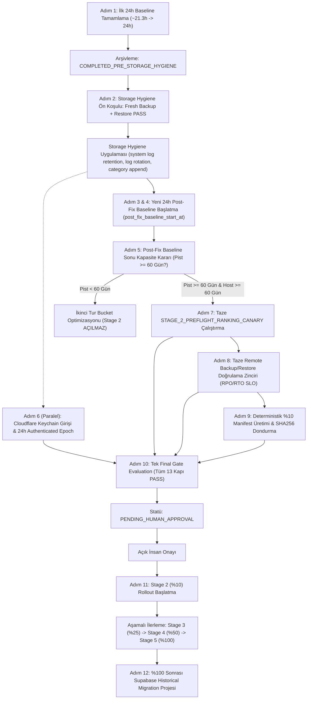

# VERİMİMARİ P1.4 — TEK MASTER PRODUCTION PLANI (%1 Rollout'tan %100 Rollout'a)

> **Statü:** AKTİF TEK MASTER PLAN  
> **Kapsam:** Verimimari Marketplace Data Platform V2 (P1.4 Stage 1'den %100 Üretim Tamamlanmasına Kadar)  
> **İlke:** Bu belge Verimimari P1.4'ün şu andan başlayıp %100 production rollout'a kadar **tek master planıdır**. Bundan sonra yeni mimari katman eklenmeyecek; yalnızca bu plandaki adımlar sırayla kapatılacaktır.  
> **Dokunulmazlık Garantisi:** Supabase tarihsel tablolarında (`product_observations`, `rankings`, `market_observations`) **0 DROP, 0 DELETE, 0 TRUNCATE, 0 INDEX DROP** (`ZERO_AUTOMATED_DELETION`). ClickHouse kullanıcı tablolarında (`verimimari_prod.*`) **TTL AÇILMAYACAKTIR**.

---

## 1. Değişmeyecek Temel Kurallar ve Değişmezler (Invariants)

1. **Stage 2 Asla Otomatik Başlamaz:** Tüm hard gate'ler sağlansa bile durum `PENDING_HUMAN_APPROVAL` olur; açık insan onayı olmadan ilerleme gerçekleşmez.
2. **Supabase Geçmişi Asla Silinmez:** `ZERO_AUTOMATED_DELETION` / `NO_DESTRUCTIVE_DELETE`. Hiçbir otomatik süreç Supabase tablolarını budayamaz.
3. **ClickHouse Kullanıcı Tablolarına TTL Uygulanmaz:** `product_observations`, `category_rank_observations`, `profile_observations`, `inventory_observations` tablolarında TTL tanımlanmaz; veriler tam arşiv olarak saklanır.
4. **Denetim Üretim Veri Havuzlarına Asla Yazmaz:** `DATA_SINK_READ_ONLY_AUDIT` (`NO_PRODUCTION_DATA_MUTATION`). ClickHouse bağlantısı `verimimari_reader` ile kilitlidir (0 INSERT/DDL yetkisi). Yalnızca telemetri state dosyaları (`ALLOWED_TELEMETRY_WRITES`) güncellenebilir.
5. **Testler Üretim Canary Satırı Üretmez:** `npm test` öncesi ve sonrası üretim ClickHouse satır sayısı değişmez (`total_preflight_rank_rows_before == total_preflight_rank_rows_after`).
6. **LLM Ürün Başına Scraper Olarak Kullanılmaz:** Deterministik, kural tabanlı çıkarım mimarisi esastır.
7. **Vercel Scraper Çalıştırmaz:** Vercel yalnızca salt-okunur dashboard/API uç noktasıdır; scraping Hermes/Mac Mini üzerindedir.
8. **Hermes Scheduler / Supervisor Olarak Kalır:** Cron ve process yönetimi Hermes üzerinden yürütülür.
9. **Outbox Dayanıklı (Durable) ve At-Least-Once Kalır:** Çift yazım (dual-write) akışında her iki sink de ACK vermeden spool silinmez; ağ kesintilerinde otomatik spool kuyruğu birikir.
10. **Gözlem Kimliği Deterministik Kalır:** `observation_id = SHA256(canonicalPart(...))` biçiminde deterministiktir; mükerrer üretim fiziksel olarak engellenir.
11. **Fail-Open Kesinlikle Yasaktır:** Herhangi bir ölçüm belirsizliği, clock skew veya eksik veri durumunda sistem güvenli tarafta kalarak (`BLOCKED` / `CAPACITY_PAUSE`) durur; asla otomatik izin vermez.

---

## 2. Mevcut Canlı Durum Özeti (2026-09-18 İtibarıyla)

| Katman / Bileşen | Durum | Canlı Metrik / Doğrulama |
| :--- | :---: | :--- |
| **Birim & Entegrasyon Testleri** | **PASS** | 95/95 test başarıyla tamamlandı (11 test paketi). |
| **Satır Sayısı Değişmezliği** | **PASS** | `npm test` öncesi = 1198 satır == sonrası = 1198 satır (0 satır eklendi). |
| **Denetim İzolasyonu** | **PASS** | `DATA_SINK_READ_ONLY_AUDIT` (`verimimari_reader` ile 0 INSERT/DDL yetkisi). |
| **Kalıcı Disk Muhasebesi** | **PASS** | Exclusive 5 bucket toplamı = 726 MB $\le$ Root delta = 801 MB (Double count: `false`). |
| **Operasyonel Kapasite Statüsü** | **SAFE** | Boş disk = 42.2 GB (>20 GB), acil crawler durdurması yok. |
| **Stage 2 Kapasite Olgunluğu** | **BLOCKED** | Kalıcı büyüme: +0.8103 GB/gün, 10 GB pisti: ~39 gün (< 60 gün şartı). |
| **İlk 24 Saatlik Baseline** | **IN_PROGRESS** | Başlangıç: `2026-09-17T22:58:29.108Z`, Geçen süre: ~21.3 saat (tamamlanmasına ~2.7 saat var). |
| **Storage Hygiene** | **BEKLEMEDE** | İlk 24 saatlik baseline bitene kadar dondurulmuştur. |
| **Cloudflare Authenticated Epoch**| **BEKLEMEDE** | Token yapılandırması bekleniyor (`MONITOR_CONFIG_MISSING`). |
| **Stage 2 Preflight Canary** | **PRE_STORAGE_PASS** | Preflight 60 satır PASS, Storage Hygiene ve post-fix canary bekleniyor. |
| **Stage 2 İlerleme Kapısı** | **FROZEN** | İnsan onayı dahil tüm geçişler dondurulmuştur. |

---

## 3. Master Plan 12 Aşamalı İlerleme Yol Haritası



---

### ADIM 1: P1.4 Stage 1 İlk Baseline'ı Tamamla ve Arşivle

- **Süre:** İlk gözlem başlangıcı `2026-09-17T22:58:29.108Z`. 24 saat tamamlanana kadar (~2026-09-18T22:58:29Z UTC / 2026-09-19T01:58:29 TRT) hiçbir crawler veya storage davranışı değiştirilmeyecektir.
- **Stage 2 Durumu:** Kesinlikle `FROZEN`.
- **24 Saat Tamamlanma Aksiyonu:**
  - Pre-fix baseline sonucu `.runtime/baseline_archive_pre_storage_hygiene.json` dosyasına arşivlenecektir.
  - Orijinal baseline dosyası (`host_disk_consumption_state.json`) overwrite edilmeyecektir.
  - Arşiv içeriği: başlangıç/son timestamp, tüm host ve persistent büyüme metrikleri, exclusive bucket detayları, mutabakat tablosu, outbox durumu, yedekleme ve test sonuçları.
  - Sınıflandırma: `COMPLETED_PRE_STORAGE_HYGIENE`.

---

### ADIM 2: İlk 24 Saat Sonrası Storage Hygiene Uygulaması

> [!IMPORTANT]
> Taze GitHub Releases yedeği alınıp restore doğrulaması PASS olmadan **hiçbir storage değişikliği yapılmayacaktır.**

1. **Ön Koşul Yedekleme ve Doğrulama:**
   - `node scripts/github_release_backup.cjs` ile AES-256-GCM şifreli tam yedekleme alınır.
   - Restore testi yapılır (`restore_test_pass == 'PASS'`).
2. **Dokunulmazlıklar:**
   - Supabase tarihsel tablolarına (`product_observations`, `rankings`, `market_observations`) kesinlikle dokunulmaz (**0 DROP, 0 DELETE, 0 TRUNCATE, 0 INDEX DROP**).
   - ClickHouse kullanıcı tablolarında (`verimimari_prod.*`) kesinlikle TTL açılmaz.
3. **Optimizasyon Alanları:**
   - **ClickHouse Dahili Log Tabloları (`system.*_log`):**
     - Körü körüne genel (generic) TTL komutu uygulanmaz.
     - Şema ve engine doğrulaması yapılmış MergeTree log tablolarına (`system.text_log`, `system.trace_log`, `system.asynchronous_metric_log`, `system.metric_log`, `system.processors_profile_log`, `system.asynchronous_insert_log` için 3 gün; `system.part_log` ve `system.query_log` için 7 gün) declarative retention XML konfigürasyonu (`system_logs_retention.xml`) uygulanır.
     - Log seviyesi `information` düzeyine indirilerek gereksiz trace şişmesi önlenir.
   - **`clickhouse-server.log` Metin Log Rotasyonu:**
     - Rotation hedefi: $50\text{ MB} \times 3$ arşiv dosyası (en fazla 150 MB tavan disk tüketimi).
   - **`categories/` Dizini Çıktı Mimarisi Düzeltmesi:**
     - `latest.json` ve `latest.csv`: salt yerinde üzerine yazma (atomic overwrite: `temp -> rename`), $O(1)$ sabit disk alanı.
     - `history.csv`: her saat tüm dosyanın baştan yazılması iptal edilir; yalnızca yeni gözlem satırları sona eklenir (**incremental append-only**). 30 günden eski veriler `history-YYYY-MM.csv.gz` olarak sıkıştırılır.
     - Mükerrer tam snapshot rewrite davranışı kaldırılır; yalnızca rank/fiyat delta'sı olan ürünler kaydedilir.
   - **Backup Staging:**
     - `.runtime/backup_staging` dizininde gereksiz mükerrer dosya üretimi engellenir ve geçici arşivler işlem sonrası duruma göre temizlenir.

---

### ADIM 3: Kalıcı Disk Muhasebesi Değişmezliğini Koru (Exclusive Buckets)

- **Mevcut Doğrulanmış Model:**
  1. `clickhouse_server_logs`: `.runtime/clickhouse_prod/var/log`
  2. `clickhouse_store`: `.runtime/clickhouse_prod/var/lib`
  3. `categories`: `categories/`
  4. `cron_logs`: `.runtime/cron-logs`
  5. `backup_staging`: `.runtime/backup_staging`
- **Açıklayıcı Alt Metrik:** `system.parts` aktif kullanıcı verisi boyutu fiziksel olarak `clickhouse_store` içinde yer aldığından persistent toplamına ikinci kez eklenmez; `explanatory_submetrics.clickhouse_user_data_parts` olarak raporlanır.
- **Muhasebe Değişmezi (Accounting Invariant):**
  $$\sum \Delta(\text{exclusive\_buckets}) \le \Delta(\text{ROOT}) + \text{tolerance (10 MB)}$$
  $$\text{double\_count\_detected} == \text{false}$$
- **Otomatik Koruma:** Eğer $\sum \Delta(\text{exclusive\_buckets}) > \Delta(\text{ROOT}) + \text{tolerance}$ olursa:
  $$\implies \text{PERSISTENT\_ACCOUNTING\_OVERLAP} \implies \text{stage2\_capacity\_readiness} = \text{FAIL}$$

---

### ADIM 4: Storage Hygiene Sonrası Yeni 24 Saatlik Baseline Başlat

- **Temiz Başlangıç:** Eski baseline başlangıcı devam ettirilmez. Yeni bir `post_fix_baseline_started_at = new Date().toISOString()` alanı oluşturulur.
- **Kapsam:** Production Stage 1 bu 24 saatte yine %1 kapsamda kalır.
- **Salt Okunur Denetim:** `DATA_SINK_READ_ONLY_AUDIT` (`NO_PRODUCTION_DATA_MUTATION`). ClickHouse bağlantısı `verimimari_reader` (0 INSERT yetkisi), Supabase restricted reader, yalnızca `ALLOWED_TELEMETRY_WRITES` yazılabilir.

---

### ADIM 5: Post-Fix Baseline Sonunda Kapasite Kararı

Kapasite değerlendirmesi iki ayrı kavrama ayrılmıştır:

1. **`operational_capacity_status` (Acil Operasyonel Emniyet):**
   - $\text{Runway} \ge 2\text{ gün}$ ve $\text{Boş Disk} > 20\text{ GB} \implies \mathbf{SAFE}$ (acil durdurma yok).
   - $\text{Runway} < 2\text{ gün}$ veya $\text{Boş Disk} \le 15\text{ GB} \implies \mathbf{CAPACITY\_PAUSE}$.
2. **`stage2_capacity_readiness` (Genişleme Hazırlık Kapısı):**
   - $\text{host\_days\_to\_10gb} \ge 60$
   - $\text{persistent\_days\_to\_10gb} \ge 60$
   - $\text{baseline\_age} \ge 24\text{ saat}$
   - $\text{isProvisional} == \text{false}$
   - $\text{double\_count\_detected} == \text{false}$
- **Karar Mantığı:** Storage Hygiene'ın başarısı persistent pisti $\ge 60$ güne çıkarmaktır. Çıkmazsa Stage 2 açılmaz; hangi exclusive bucket'ın büyüdüğüne göre hedeflenmiş ikinci optimizasyon yapılır.

---

### ADIM 6: Cloudflare Authenticated Epoch (Storage Hygiene ile Paralel)

- **Gizlilik İlkesi:** Mac Mini'de Access Client ID ve Secret **yalnızca macOS Keychain'e** girilecektir (`bash scripts/add_cf_access_keychain.sh`). Chat, Git ve loglara secret yazılması kesinlikle yasaktır.
- **Doğrulama:** `node scripts/verify_tunnel_probes.cjs`
- **Epoch Başlangıcı:** İlk başarılı authenticated `SELECT 1` $\to$ HTTP 200 anı yeni tunnel epoch başlangıcı kabul edilir.
- **Hard Gate Kriterleri:**
  - `cloudflared process` = `UP`
  - `named tunnel` = `CONNECTED`
  - `authenticated SELECT` = `200`
  - `unauthenticated request` = `DENIED (403)`
  - `epoch duration` $\ge 24\text{ saat}$
  - `uptime ratio` $\ge 99\%$
  - `fresh probe` = `PASS`
- Eski `MONITOR_CONFIG_MISSING` olayları olay geçmişinde (incident history) kalır fakat yeni epoch hesabını zehirlemez.

---

### ADIM 7: Post-Fix Baseline Bitiminde Taze Ranking Canary

- **İzolasyon Kuralı:** Audit veya `npm test` asla canary başlatmaz.
- **Açık Çalıştırma:** Yalnızca açık komutla çalıştırılır:
  ```bash
  node scripts/stage_2_preflight_ranking_canary.cjs
  ```
- **Final Canary Şartları:**
  - `latest_canary_status` = `PASS`
  - `latest_canary_age` $\le 24\text{ saat}$
  - `latest_canary_completed_at` > `last_storage_hygiene_change_at`
  - `latest_preflight_rank_rows` > 0
  - `dedicated_rank_reconciliation` = `PASS`
  - `duplicate_rank_observations` = 0
  - `outbox_pending_batches` = 0
  - Sınıflandırma: `POST_STORAGE_HYGIENE_PASS`
- Canary yalnızca dedicated sink `category_rank_observations` üzerinden doğrulanır.

---

### ADIM 8: Final Fresh Backup / Restore Kapısı

- Eski cache'den okunamaz; Stage 2 karar anında canlı ve taze doğrulanır.
- `backup_age` $\le 24\text{ saat}$, `restore_age` $\le 24\text{ saat}$, restore edilen snapshot ID ile latest backup ID birebir eşleşmelidir.
- **Tam Kanıt Zinciri:**
  $$\text{Parquet Dışa Aktarım} \to \text{AES-256-GCM Şifreleme} \to \text{GitHub Release Yükleme} \to \text{Remote İndirme} \to \text{SHA256 Doğrulama} \to \text{Şifre Çözme} \to \text{Temp CH Restore} \to \text{Satır \& Checksum PASS}$$
- **DR Standardı:** Hedef/SLO olarak $\text{RPO} \le 24\text{ saat}$, $\text{RTO} \le 2\text{ saat}$ kullanılır. "Mutlak sıfır veri kaybı" ifadesi kullanılmaz; `ZERO_AUTOMATED_DELETION` terminolojisi korunur.

---

### ADIM 9: Deterministik %10 Manifest Üret ve Dondur

- **Kapsam Belirleme:** Artık her N'inci kategori alınmayacaktır.
- **Temsiliyet:** 15 root departmanı ve kategori hacimlerini temsil eden dengeli gruplar (light / medium / heavy) kullanılır.
- **Dondurma:** Manifest üretildikten sonra kategori ID listesi ve manifest SHA256 özeti dondurulur (`.runtime/stage_2_manifest_10pct.json`).
- **Veri Akışı Sözleşmesi:** Stage 2 açıldığında hem `product_observations` hem de `category_rank_observations` üretim akışları `REQUIRED_ACTIVE` olacaktır. `profile_observations` ve `inventory_observations` hangi aşamalarda aktif olacaksa aşama sözleşmesinde açıkça yazılacaktır.

---

### ADIM 10: Tek Final Gate Evaluation ve İnsan Onayı

Tüm metrikler tek bir atomik `evaluation_timestamp` anında yeniden hesaplanır; geçmiş PASS sonuçları körlemesine taşınmaz.

| No | Hard Gate Adı | Gerekli Kriter |
| :---: | :--- | :--- |
| 1 | `tunnel_health` | Authenticated Uptime $\ge 99\%$, rolling window $\ge 24$h, SELECT 200, unauthenticated DENIED |
| 2 | `eligible_reconciliation` | %100 eligible runs PASS (14/14 metrik) |
| 3 | `duplicate_validation` | Current validation PASS (0 mükerrerlik) |
| 4 | `outbox_health` | Backlog 0, peak backlog 0, spool age normal |
| 5 | `backup_restore_fresh` | Live uncached: yaş $\le 24$h, aynı snapshot ID ve tam kanıt zinciri |
| 6 | `operational_capacity` | `SAFE` (boş disk > 20 GB, runway >= 2 gün) |
| 7 | `stage2_capacity_readiness` | `PASS` (host runway >= 60 gün, persistent runway >= 60 gün, baseline >= 24h, !provisional) |
| 8 | `persistent_accounting` | `PASS` (sum buckets <= root delta + tolerance, double_count_detected = false) |
| 9 | `clickhouse_sample_match` | `PASS` (compressed size == end_bytes) |
| 10 | `schema_health` | `PASS` (4/4 üretim tablosu şemada mevcut) |
| 11 | `parts_health` | `PASS` (aktif parça $\le 50$, merge = 0) |
| 12 | `stage1_write_coverage` | `PASS` (Stage 1 sözleşmesi tam sağlandı) |
| 13 | `post_fix_baseline_24h` | `PASS` (Storage hygiene sonrası temiz 24h tamamlandı) |
| 14 | `fresh_ranking_canary` | `POST_STORAGE_HYGIENE_PASS` (taze çalıştırılmış, yaş $\le 24$h, 9/9 rec, 0 dup, 0 outbox) |

- **Geçiş Koşulu:** Yalnızca yukarıdaki **tüm şartlar aynı anda PASS** olduğunda statü `PENDING_HUMAN_APPROVAL` olur.
- Tek bir FAIL / WAITING / STALE durumunda sistem `FROZEN` kalır.
- Kullanıcının açık onayı (`--human-approval` veya `STAGE_2_HUMAN_APPROVAL=true`) ile %10 rollout başlar.

---

### ADIM 11: Sonraki Aşamaların İlerleme Modeli (Stage 2 $\to$ 3 $\to$ 4 $\to$ 5)

Her aşamada aynı emniyet modeli tekrarlanacaktır:

```
Stage 1: %1   (Mevcut canlı aşama - ~40 kategori)
Stage 2: %10  (Genişleme aşaması - ~400 kategori, deterministik manifest)
Stage 3: %25  (~1.000 kategori, profile_observations devreye alınabilir)
Stage 4: %50  (~2.000 kategori)
Stage 5: %100 (Tüm ~4.000 kategori, inventory_observations devreye alınabilir)
```

- Her yükseltmede yeni kapsam deterministik manifest ile dondurulur.
- Bir önceki aşamanın reconciliation, duplicates, outbox, ClickHouse parts, tunnel, disk growth ve backup kapıları PASS olmadan sonraki aşama açılmaz.
- **Hiçbir aşamada otomatik yükseltme (auto-promote) yoktur.**

---

### ADIM 12: %100 Rollout Sonrası Supabase Historical Migration Projesi

- Bu adım ayrı bir proje olarak ele alınacaktır.
- **Ön Koşul:** ClickHouse ileriye dönük çift yazımın (forward dual-write) **en az 7–14 gün boyunca** kesintisiz stabil çalıştığı kanıtlanacaktır.
- **Sıralı Adımlar:**
  1. Historical backfill (geçmiş verilerin ClickHouse'a aktarımı).
  2. Parquet dışa aktarım, checksum ve mutabakat doğrulaması (`computeLogicalDatasetChecksum`).
  3. Off-host bağımsız cold backup alınması.
  4. Supabase tarihsel tablolarından hiçbir veri kullanıcının **açık yazılı onayı olmadan SİLİNMEYECEKTİR**.
  5. İlk etapta Supabase güncel/entity/operasyonel gerçeklik kaynağı (source of truth) olarak kalacak; ClickHouse analitik/tarihsel zaman serisi kaynağı olacaktır.
  6. Migration kanıtlandıktan sonra Supabase tarihsel ayak izi azaltma aşamasına geçilecektir.
